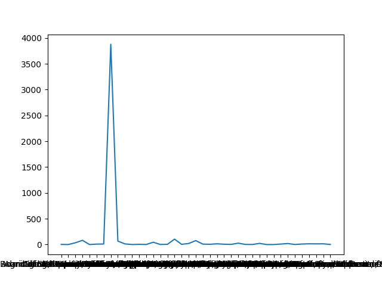

# Data Overview

1. **Number of columns**: 32  
   **Number of rows**: 346,018

---

2. **Classification Codes and Normalized UNSPSC was matched**

---

3. **Columns with no missing values**:  
   `['_id', 'Creation Date', 'Fiscal Year', 'Purchase Order Number', 'Acquisition Type', 'Acquisition Method', 'Department Name', 'CalCard']`

---

# Missing Values Report

## Columns with more than 50% missing values

| Column Name             | Missing Count | Data Type |
|-------------------------|---------------|-----------|
| LPA Number              | 253,673       | object    |
| Requisition Number      | 331,649       | object    |
| Sub-Acquisition Type    | 277,681       | object    |
| Sub-Acquisition Method  | 315,122       | object    |
| Supplier Qualifications | 204,273       | object    |

---

## Columns with more than 25% missing values

| Column Name             | Missing Count | Data Type |
|-------------------------|---------------|-----------|
| LPA Number              | 253,673       | object    |
| Requisition Number      | 331,649       | object    |
| Sub-Acquisition Type    | 277,681       | object    |
| Sub-Acquisition Method  | 315,122       | object    |
| Supplier Qualifications | 204,273       | object    |

---

4. From the above reports (50% and 25%), we can see that the same 5 columns have a high percentage of missing values.

- **Column**: LPA Number - **Missing Values Percentage**: 73.31%
- **Column**: Requisition Number - **Missing Values Percentage**: 95.85%
- **Column**: Sub-Acquisition Type - **Missing Values Percentage**: 80.25%
- **Column**: Sub-Acquisition Method - **Missing Values Percentage**: 91.07%
- **Column**: Supplier Qualifications - **Missing Values Percentage**: 59.04%

---

5. I have 30 rows with missing price values. After investigation, I can't find a pattern that helps me fill those missing values, like family or products with the same classification codes. Also, I think it's hard to fill them as unique creation and purchasing dates and supplier names all reflect on pricing.

---

6. What I will try to do now is fill the missing values in the Purchase Date using the Creation Date and Fiscal Year.

- **Show the Fiscal Year that contains the most missing Purchase Dates.**
- **Show the department name that contains the most missing Purchase Dates, as data entry will be the same for every department.**
- **Try to extract a pattern from here.**

Missing Values in Fiscal Year:  
Fiscal Year  
2012-2013: 6,332  
2013-2014: 6,549  
2014-2015: 4,555  

- No exact pattern in Fiscal Year, will add more grouping based on Department Name.  
  **Very Well, We Found A Pattern In Department Name**

There is a relationship between Department Name and Purchase Date.  
**As Shown In The Figure**  
  
  

I can see that the Department Name with the largest number of missing Purchase Dates is Consumer Affairs.  
So we will fill the Purchase Date with the mean of the period each department takes to fill the Purchase Date. It's the difference in days between the Creation Date and the Purchase Date.

---

7. **Number of Missing Values in CalCard**: 0  
   **With Unique Values**: `['NO', 'YES']`  
   **Value Counts**:  
   CalCard  
   NO: 340,646  
   YES: 5,372  

   This shows there is no balance in CalCard. Most purchases are without a credit card.  
   

   Can't find any pattern or reason about why a little number of operations is using CalCard, so we will keep it as it is.

---

---

8. **Number Of Operations In June Is High, In Every Fiscal Year**

---

9. **Top Class and Family Titles by Fiscal Year**

- **2012-2013**
  - **Top Class Title**: Printer and facsimile and photocopier supplies
  - **Top Family Title**: Office machines and their supplies and accessories

- **2013-2014**
  - **Top Class Title**: Petroleum and distillates
  - **Top Family Title**: Fuels

- **2014-2015**
  - **Top Class Title**: Petroleum and distillates
  - **Top Family Title**: Fuels

---

10. **Total Spending By Fiscal Year**

- **2012-2013**
  - **Top Class Title**: Printer and facsimile and photocopier supplies
  - **Top Family Title**: Office machines and their supplies and accessories
  - **Total Spending**: $62,054,189,182.06

- **2013-2014**
  - **Top Class Title**: Petroleum and distillates
  - **Top Family Title**: Fuels
  - **Total Spending**: $42,543,169,213.68

- **2014-2015**
  - **Top Class Title**: Petroleum and distillates
  - **Top Family Title**: Fuels
  - **Total Spending**: $46,989,774,165.58

---

11. **Top Supplier by Number of Operations By Fiscal Year**

- **2012-2013**
  - **Top Supplier**: 1,249,060.0

- **2013-2014**
  - **Top Supplier**: 1,743,406.0

- **2014-2015**
  - **Top Supplier**: 1,743,406.0

---

12. **Top Supplier and Total Spending By Fiscal Year**

- **2012-2013**
  - **Top Supplier**: 1,087,520.0 
  - **Total Spending**: $11,160,129,000.04

- **2013-2014**
  - **Top Supplier**: 1,029,823.0
  - **Total Spending**: $1,029,823.0

- **2014-2015**
  - **Top Supplier**: 1,743,406.0
  - **Total Spending**: $3,509,792,000.0

---

13. **Why is the number of operations always high in June in every fiscal year?**

- **Top Class and Family Titles by Fiscal Year**

  - **2012-2013**
    - **Top Class Title**: Printer and facsimile and photocopier supplies
    - **Top Family Title**: Office machines and their supplies and accessories

  - **2013-2014**
    - **Top Class Title**: Petroleum and distillates
    - **Top Family Title**: Fuels

  - **2014-2015**
    - **Top Class Title**: Petroleum and distillates
    - **Top Family Title**: Fuels

After searching, it's not according to Family or Class; it's because it is the end of the Fiscal Year. Many states expand high in June in every Fiscal Year.  
The government of California tends to spend more in June than in any other month for several reasons related to budget management and the fiscal year:

1. **End of the Fiscal Year**: June marks the end of the fiscal year in California, which concludes on June 30th. During this month, government agencies aim to ensure that they have fully utilized their allocated budget to avoid reductions in the next fiscal year.

2. **Settling Accounts**: Agencies need to settle their accounts and ensure that all bills and dues are paid before the fiscal year ends. This leads to increased spending during this month.

3. **Reallocation of Funds**: Sometimes, there are unused funds in the budget that need to be reallocated or spent before the fiscal year ends to avoid losing them.

4. **Preparation for the New Fiscal Year**: Preparing for the new fiscal year may require additional spending at the end of the current year to ensure a smooth transition between fiscal years.

These combined factors lead to increased government spending in June compared to other months of the year.

---

14. **"Requisition Number", "Purchase Order Number" are similar columns**  
    What's the difference between "Requisition Number" and "Purchase Order Number"?

- **Requisition Number**:
  - **Purpose**: The requisition number is used to identify a request for goods or services within an organization. It is typically generated when a department or individual within the organization identifies a need and formally requests the procurement of specific items or services.
  - **Stage**: This number is associated with the initial stage of the procurement process, where the need is identified and approved internally before any purchasing action is taken.
  - **Usage**: It helps track and manage internal requests and approvals before they are converted into purchase orders.

- **Purchase Order Number**:
  - **Purpose**: The purchase order number is used to identify a formal order placed with a supplier for goods or services. It is generated after a requisition has been approved and the procurement process has moved forward to the purchasing stage.
  - **Stage**: This number is associated with the later stage of the procurement process, where the organization commits to purchasing the items or services from a supplier.
  - **Usage**: It serves as a legal document and reference for the transaction between the purchasing organization and the supplier, detailing the items, quantities, and agreed prices.

**In some rows, there is no Requisition Number but there is a Purchase Order Number, like index 3, 4, but this does not affect the analysis.**

---

15. **Number of Duplicated Rows**: 2,084

---

16. **Location Column is a string that contains zipcode and latitude and longitude**  
    **I will split the string into 3 columns: Zip Code, Latitude, and Longitude**

---

17. **Number of locations inside California**: 247,729

---

18. **Most Common Acquisition Method in Every Fiscal Year**  
    For all fiscal years, the most common acquisition method is 'Informal Competitive', followed by 'Statewide Contract', and then 'SB/DVBE Option'.

- **Informal Competitive**: This refers to a procurement process where multiple suppliers or service providers compete for a contract, but the process is less formal and may not involve complex official procedures.

- **Statewide Contract**: This indicates contracts that are established at the state level, meaning they are available for use by all government entities within that state.

- **SB/DVBE Option**: This refers to special options or programs that support Small Businesses (SB) or Disabled Veteran Business Enterprises (DVBE). These options are designed to encourage and support these categories of businesses in government procurement processes.

---
