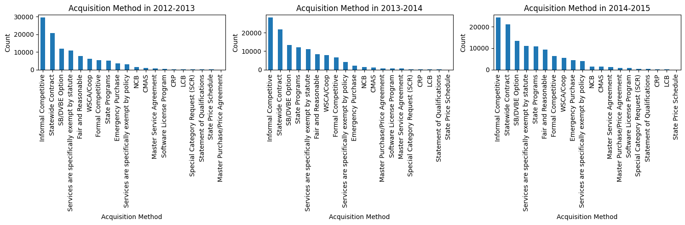
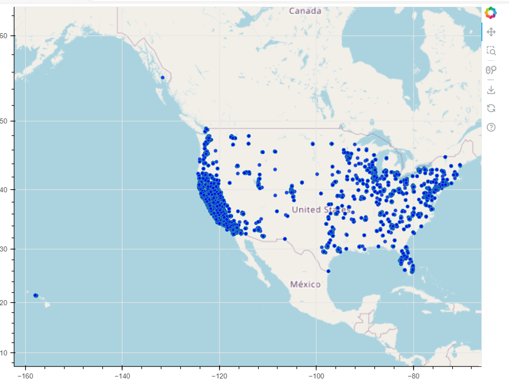

# State of California Large Purchases Data Processing

This project focuses on processing and analyzing data on large purchases by the State of California. The data is sourced from [Kaggle](https://www.kaggle.com/datasets/sohier/large-purchases-by-the-state-of-ca) and provides insights into state contracts and purchases over $5,000 from the fiscal years 2012-2015. 

## Dataset Overview
The **State Contract and Procurement Registration System (SCPRS)** was created in 2003 to centralize state contracts and purchases data. This dataset is an extract from the eProcurement (eSCPRS) system as of March 16, 2009, including transactions over $5,000 for:
- Fiscal Years: 2012-2013, 2013-2014, and 2014-2015.


## Project Structure

The project is organized into two main Jupyter notebooks:
1. **Data-Exploration.ipynb** - Focuses on exploratory data analysis (EDA).
2. **Data-Pipeline.ipynb** - Implements a data processing pipeline for efficient handling and cleaning of the dataset.

Additionally, supporting files and classes are provided for MongoDB data management and for logging key insights and plots.

### File Structure

├── Data-Exploration.ipynb # Handles data exploration, EDA, and visualization <br>
├── Data-Pipeline.ipynb # Sets up data cleaning and transformation pipeline  <br>
├── notes.md # Stores notes and observations during EDA  <br>
├── decisions.md # Records decisions made about data processing  <br>
├── saved_plots/ # Contains all generated plots  <br>
└── README.md # Project overview and documentation <br>


## Notebooks

### 1. Data-Exploration.ipynb

This notebook includes exploratory data analysis steps and basic data operations. Key features:
- **MongoDB Data Export**: Extracts data from MongoDB and converts it into a DataFrame for analysis.
- **Data Analysis and Visualization**: Generates and saves key visualizations.
- **Notes and Observations**: Logs findings in `notes.md` for easy reference.

#### Example Code Snippets

**MongoDB Data Export Function**

```python
from pymongo import MongoClient
import pandas as pd

def export_dataset(mongoClient: MongoClient, database: str, collection: str, path: str) -> pd.DataFrame:
    """
    Export a MongoDB collection to a CSV file and return it as a DataFrame.
    """
    try:
        db = mongoClient[database]
        collection = db[collection]
        df = pd.DataFrame(list(collection.find()))
        df.to_csv(path, index=False)
        print("Data exported successfully.")
        return df
    except Exception as e:
        print(e)
        return pd.DataFrame()  # Return an empty DataFrame in case of an error

```
## Notes and Plot Saving

### To log important observations and save plots, the Notes class is used:

```python
import os
import matplotlib.pyplot as plt

class Notes:
    def __init__(self, file_path: str, plots_folder: str = 'saved_plots'):
        self.file_path = file_path
        self.plots_folder = plots_folder
        os.makedirs(self.plots_folder, exist_ok=True)

    def take_message(self, message: str) -> None:
        with open(self.file_path, 'a') as file:
            file.write(message + '\n')
        
    def save_plot(self, plot_func, image_name: str, *args, **kwargs) -> None:
        image_path = os.path.join(self.plots_folder, image_name)
        plot_func(*args, **kwargs)
        plt.savefig(image_path)
        plt.close()
        self.take_message(f"")
```
### Example Usage

```python
notes = Notes('notes.md')
notes.take_message("Exploratory data analysis completed on initial dataset.")
```


## 2. Data-Pipeline.ipynb

This notebook is designed for setting up a data processing pipeline, with classes for MongoDB operations and data transformation steps. The pipeline structure allows for scalable and modular data transformations, making it easier to apply consistent cleaning and formatting steps.

### Key Classes and Functions

#### MongoDB Management Class

The `MongoManagement` class manages MongoDB interactions, including exporting data and inserting processed results.
``` python
from pymongo import MongoClient
import pandas as pd

class MongoManagement:
    def __init__(self, mongo_client: MongoClient, database: str):
        self.mongo_client = mongo_client
        self.database = mongo_client[database]

    def export_dataset(self, collection: str, path: str) -> pd.DataFrame:
        """
        Export dataset from MongoDB collection to a DataFrame and save as CSV.
        """
        try:
            collection = self.database[collection]
            df = pd.DataFrame(list(collection.find()))
            df.to_csv(path, index=False)
            print("Data exported successfully.")
            return df
        except Exception as e:
            print(e)
            return pd.DataFrame()

    def add_df_to_collection(self, df: pd.DataFrame, collection: str):
        """
        Insert a DataFrame into a MongoDB collection.
        """
        try:
            collection = self.database[collection]
            collection.insert_many(df.to_dict('records'))
            print("Data added to collection successfully.")
        except Exception as e:
            print(e)
```
#### Pipeline Structure

The pipeline uses an abstract `Step` class to define individual steps, enabling flexible addition or modification of processing steps.

```python

from abc import ABC, abstractmethod

class Step(ABC):
    @abstractmethod
    def run(self, data):
        pass

class Pipeline:
    def __init__(self, steps):
        self.steps = steps

    def execute(self, data):
        for step in self.steps:
            data = step.run(data)
        return data
```

### Example Pipeline Execution

To process and insert data, use the `process_and_insert` function of the `MongoManagement` class:

```python
# Example usage
mongo_manager = MongoManagement(mongo_client, 'database_name')
df = mongo_manager.export_dataset('collection_name', 'path/to/save.csv')
pipeline = Pipeline(steps=[Step1(), Step2(), ...])  # Define your steps
mongo_manager.process_and_insert(df, pipeline, 'target_collection')
```

# Project Structure and Requirements

## Saved Plots Folder
All visualizations generated during the Exploratory Data Analysis (EDA) phase are saved in the `saved_plots/` folder. This allows for easy reference and helps track analysis progress over time.






## Additional Files
- **`notes.md`**: Logs observations and important notes from the EDA phase.
- **`decisions.md`**: Documents decisions about data processing and transformations to provide quick context on the data handling strategy.

This project aims to provide a comprehensive yet concise overview of the work and effort involved. The focus is on summarizing key findings and decisions to give a clear understanding of the project's scope and direction. For a more detailed exploration of the investigated work, please refer to the accompanying notebooks.

## Requirements
To ensure the project runs smoothly, the following software and libraries are required:

- **Python 3.7+**
- **MongoDB** and **pymongo**
- **Pandas**
- **Matplotlib** (for plotting)
- **Jupyter Notebook** (for running `.ipynb` files)

## Installation
To install the necessary packages, run the following command:

```bash
pip install -r requirements.txt
```

This command will install all the dependencies listed in the `requirements.txt` file.

---

### Author 
Abdelwahab Elghandour